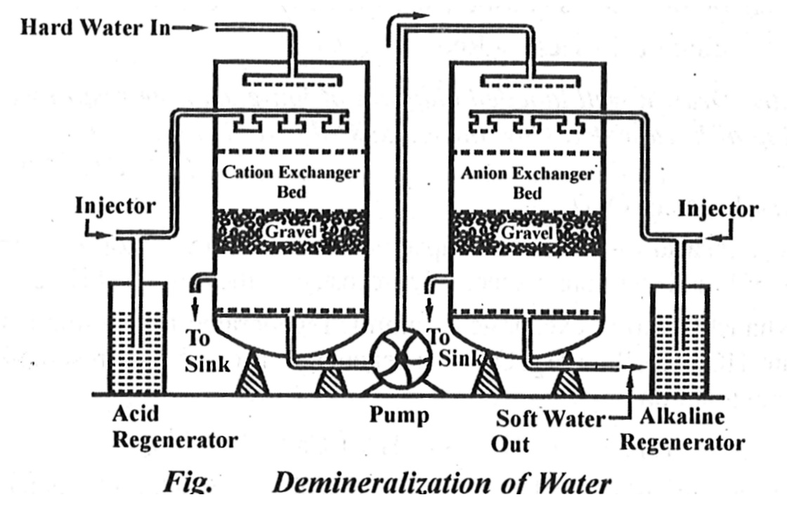

<!DOCTYPE html>
<html lang="en">
<head>
    <meta charset="UTF-8">
    <meta http-equiv="X-UA-Compatible" content="IE=edge">
    <meta name="viewport" content="width=device-width, initial-scale=1.0">
    <title>Document</title>
</head>
<body>
    <pr><h2> The process of removal hardness producing salts from water is known as softening of water. 
         -> Ion exchange process is also known as demineralisation method. 
         ->Ion exchange resins are insoluble cross linked long chain organic polymers with micro porous 
          structure and the functional groups attached to the chains are responsible for the ion exchange properties 
         ->Resins of acidic functions are capable of exchanging h+ ions with other cations. 
         ->Resins with basic function groups are capable for oh- ions with other anions. </pr></h2>

      <h2>Resins are classified into two types.</h2>

    <pr><h1> 1. Cation exchange resins:-</h1><h2> cation exchange resins are stynene de vinyl benzene co-polymers.
         which are contains sulphonation (so3h),(cooh)   are functional groups which are responsible for exchange
        their h+ ions with cations in water </pr></h2>

       <h1>-> (ca+2,Mg+2) </h1>
               <h2>2RH+Cacl2 --> R2ca+2Hcls 
                 2RH+Mgcl2 --> R2mg+2Hcl  
                 2RH+Mgso4 --> R2ca+ H2SO4 </h2>

        <h1>Anion Exchange resin:-</h1> 
       <pr <h2>Anion exchange resin are phenol formaldheyene (or) amine formaldheye polymers which contains 
           (NH2, -OH)   basic functional function groups which are responsible for exchane their oh- ions with
           anions in water (CN-,SO4). 
               2ROH+2HCL->H2o+2RCL 
               2ROH+H2SO4->H2O+2RSO4. </h2>
        <h2> ->In ion exchange process hardness water is allowed to pass through cation exchange resins which  
             remove Ca+2 and Mg+2 ions and exchange equivalent amount of H+ ions. 
            ->Anions exchange resins remove cl-,SO4-2 from water exchange equivalent amount of OH- ions. 
        </h2>
          </pr>
       <h1>Regeneration</h1> 
      <h2>when cation exchange lossed capacity of producing H+ ions & anion exchange losses capacity of producing OH- ions
          they are said to be exhausted. 
           These exchasuted cation exchange and anion exchanger are regenerated be dilute HCL and dilute in NAOH. 
           R2Ca+2HCL->2RH+Cacl2 
           R2Mg+2HCL->2RH+Mgcl2 
           2RCL+2NAOH+2ROH+2NACL.  
        
      </h2>

            
            

    
</body>
</html>
